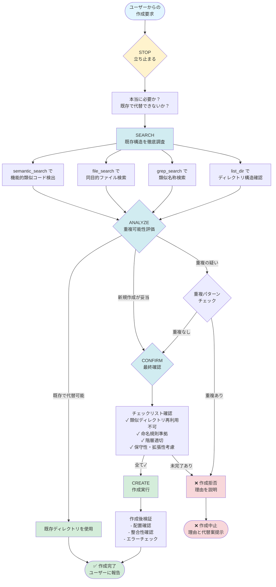

# AIプロジェクト構造保護ガイドライン

## 概要

このファイルは、AIがプロジェクトでファイル・ディレクトリを作成する際の厳格な制約を定義します。一貫性のある高品質なプロジェクト構造を維持するための必須要件を規定します。

## このファイルの役割

このガイドラインは **プロジェクト構造保護と整合性維持** に特化しています。コードの内容やスタイルには触れません。コード執筆に関する指示は [ai-code-writing.instructions.md](./ai-code-writing.instructions.md) を参照してください。

- **適用対象**: ディレクトリ構造、ファイル配置、構造保護ルール
- **他ガイドラインとの関係**:
  - [ai-code-writing.instructions.md](./ai-code-writing.instructions.md): コード内容とスタイル
  - [ai-advanced-patterns.instructions.md](./ai-advanced-patterns.instructions.md): 高度なコードパターン
  - [ai-code-examples-reference.instructions.md](./ai-code-examples-reference.instructions.md): コード例集

## 最重要ルール (MUST)

### 重複ディレクトリの作成禁止

以下のような重複パターンは **絶対に避ける** こと:

#### 1. 同一機能の重複ディレクトリ

```
❌ 禁止パターン
src/
  utils/
  utilities/      # utilsと同じ目的
  helpers/        # utilsと同じ目的
```

```
❌ 禁止パターン
src/
  services/
  service/        # 単数形・複数形の混在
```

```
❌ 禁止パターン
src/
  models/
  model/          # 単数形・複数形の混在
```

#### 2. 異なる命名の同一目的ディレクトリ

```
❌ 禁止パターン
src/
  components/
  widgets/        # componentsと同じ目的
```

```
❌ 禁止パターン
src/
  validators/
  validation/     # validatorsと同じ目的
```

```
❌ 禁止パターン
tests/
  unit/
  unittest/       # unitと重複
```

#### 3. 階層の不整合による重複

```
❌ 禁止パターン
src/
  services/
    user_service.py
  user/
    service.py    # servicesとuserの役割が不明瞭
```

```
❌ 禁止パターン
src/
  api/
    routes/
  routes/         # api/routesと重複
```

```
❌ 禁止パターン
config/
  app_settings.json
src/
  config/         # ルート階層のconfig/と重複
```

```
❌ 禁止パターン
docs/
  design_spec.md
src/
  docs/           # ルート階層のdocs/と重複
```

#### 4. 言語混在による重複

```
❌ 禁止パターン
src/
  models/
  modelos/        # 英語とスペイン語の混在
  modèles/        # 英語とフランス語の混在
```

#### 5. 略語と完全形の混在

```
❌ 禁止パターン
src/
  config/
  configuration/  # configと同じ意味
```

```
❌ 禁止パターン
src/
  docs/
  documentation/  # docsと同じ意味
```

```
❌ 禁止パターン
src/
  db/
  database/       # dbと同じ意味
```

#### 6. 技術スタック間の重複

```
❌ 禁止パターン
java-app/
  src/main/java/com/factory/ml/util/
python-trainer/
  src/util/       # java側のutilと目的が重複する可能性
```

### 重複チェック手順 (MUST)

新しいディレクトリを作成する前に、**必ず以下を確認**:

1. **既存ディレクトリの確認**
   - `grep_search` または `list_dir` で既存構造を把握
   - 類似名称のディレクトリが存在しないか確認

2. **名称の統一性チェック**
   - 単数形/複数形の統一
   - 略語/完全形の統一
   - 言語の統一（英語推奨）

3. **階層構造の整合性確認**
   - 同じ目的のディレクトリが異なる階層に存在しないか
   - 親子関係が適切か

4. **プロジェクト全体での一貫性**
   - 既存の命名規則に従う
   - チーム・プロジェクトの慣習を尊重

## 必須事前確認プロセス (MUST)

### STOP-SEARCH-ANALYZE-CONFIRM-CREATE プロセス

新規ファイル・ディレクトリ作成時は、以下のプロセスを**必ず遵守**すること:

#### 1. STOP（停止）

ファイル・ディレクトリを作成する前に、**一度立ち止まる**こと。

- 即座に作成せず、必要性と配置を再考する
- 「本当にこの場所に必要か？」を自問する
- 衝動的な作成を避ける
- 既存構造への影響を考慮する

#### 2. SEARCH（既存構造検索）

既存のプロジェクト構造を**徹底的に調査**すること。

**必須の検索項目**:
- `list_dir` で関連ディレクトリ構造を把握
- `grep_search` で類似名称のディレクトリ・ファイルを検索
- `file_search` で既存の同目的ファイルを探索
- `semantic_search` で機能的に類似するコードを検出

**検索すべき対象**:
- 同じ名前（単数形/複数形含む）
- 類似の目的を持つディレクトリ
- 同じ階層に存在する可能性のあるディレクトリ
- 異なる階層だが同じ役割を持つディレクトリ

#### 3. ANALYZE（分析）

検索結果を**慎重に分析**し、重複の可能性を評価すること。

**分析観点**:
- **機能的重複**: 既存ディレクトリと目的が重複していないか
- **命名の一貫性**: プロジェクトの命名規則に従っているか
- **階層の適切性**: 配置する階層は論理的に正しいか
- **スコープの明確性**: ディレクトリの責任範囲は明確か
- **将来の拡張性**: スケーラブルな構造か

**判断基準**:
```
✅ 作成すべき場合:
- 既存ディレクトリで代替不可能
- 明確に異なる責任範囲を持つ
- プロジェクト規約に準拠している
- 将来的な保守性を向上させる

❌ 作成すべきでない場合:
- 既存ディレクトリで十分代替可能
- 目的が曖昧または重複している
- 命名規則が不統一
- 一時的な必要性しかない
```

#### 4. CONFIRM（作成可否確認）

作成の妥当性を**最終確認**すること。

**確認項目チェックリスト**:
- [ ] 既存の類似ディレクトリを再利用できないか確認済み
- [ ] プロジェクトの命名規則に準拠しているか確認済み
- [ ] 配置する階層が論理的に正しいか確認済み
- [ ] 重複チェック手順を完了している
- [ ] 将来的な保守性とスケーラビリティを考慮済み
- [ ] チーム・プロジェクトの慣習と一致している

**確認時の自問**:
- このディレクトリは本当に必要か？
- 既存の構造を活用できないか？
- 3ヶ月後も適切な配置と言えるか？
- 他の開発者が理解しやすい構造か？

#### 5. CREATE（作成）

上記すべてのステップを完了し、妥当性が確認できた場合のみ作成する。

**作成時の注意**:
- `create_file` または `create_directory` を使用
- 適切な権限とパーミッションを設定
- 必要に応じて README.md や .gitkeep を追加
- 作成後は git status で変更を確認

**作成後の検証**:
- 期待通りの場所に作成されたか確認
- プロジェクト全体の整合性を確認
- エラーや警告が発生していないか確認
- 作成理由を明確化し、ユーザーに報告

---

### プロセス適用例

#### 良い例：プロセスを遵守した作成

```
ユーザー要求: 「バリデーション用のディレクトリを作りたい」

1. STOP: 即座に作成せず立ち止まる
2. SEARCH: 
   - list_dir で src/ 配下を確認
   - grep_search で "valid" を検索
   - 発見: src/validators/ が既に存在
3. ANALYZE:
   - validators/ は同じ目的を持つ
   - 新規作成は重複になる
4. CONFIRM:
   - 既存 validators/ で十分
   - 新規作成は不要と判断
5. CREATE: 作成せず、既存ディレクトリを使用

結果: ✅ 重複を回避、構造の一貫性を維持
```

#### 悪い例：プロセスを無視した作成

```
ユーザー要求: 「バリデーション用のディレクトリを作りたい」

1. STOP: スキップ（即座に作成判断）
2. SEARCH: スキップ（既存構造を調査せず）
3. ANALYZE: スキップ（重複チェックなし）
4. CONFIRM: スキップ（妥当性確認なし）
5. CREATE: src/validation/ を作成

結果: ❌ src/validators/ と重複、構造が破綻
```

---

### プロセス遵守の重要性

このプロセスを遵守することで:
- **重複ディレクトリの防止**: 構造の一貫性を維持
- **保守性の向上**: 将来的な混乱を回避
- **チーム協調**: 他の開発者が理解しやすい構造
- **品質の担保**: 高品質なプロジェクト構造を保証

**警告**: このプロセスをスキップすると、プロジェクト構造が破綻し、長期的な保守コストが増大します。必ず遵守してください。

## 新規ファイル・ディレクトリ作成判断フロー



**フロー使用時の注意点**:
- すべてのステップを順守すること
- ショートカットや省略は厳禁
- 判断に迷った場合は作成を見送る
- ユーザーに明確な理由を説明する

## ML/AIプロジェクト特有の構造保護ルール

### 1. 実験管理の一元化（MUST）

ML/AIプロジェクトでは実験管理を**一箇所に集約**すること。

```
✅ 推奨パターン
experiments/
  exp_001_baseline/
    config.yaml
    results.json
    model.onnx
  exp_002_feature_engineering/
    config.yaml
    results.json
    model.onnx

❌ 禁止パターン
src/
  experiments/          # 分散している
models/
  experiments/          # 同じ目的で複数存在
python-trainer/
  my_experiments/       # 命名も不統一
```

**ルール**:
- 実験結果は `experiments/` または `mlruns/` に統一
- 実験IDは連番または日付ベースで統一
- 各実験に設定ファイルと結果ファイルを必ず含める

### 2. モデル成果物の分離（MUST）

学習済みモデルと学習コードは**明確に分離**すること。

```
✅ 推奨パターン
models/
  current/              # 現在使用中のモデル
    model_v1.2.3.onnx
  archive/              # 過去のモデル
    model_v1.2.2.onnx
    model_v1.2.1.onnx
python-trainer/
  src/
    trainer/            # 学習コード
      model_trainer.py

❌ 禁止パターン
python-trainer/
  models/               # 学習コードとモデルが混在
    model_v1.onnx
  src/
    model_trainer.py
```

**ルール**:
- モデルファイル (.onnx, .pkl, .h5等) は `models/` に配置
- バージョン管理を明確にする（`current/`, `archive/`）
- 学習コードは `python-trainer/src/` に配置
- モデルとコードの依存関係をドキュメント化

### 3. データパイプラインの統一（MUST）

データ処理パイプラインは**一貫した構造**を維持すること。

```
✅ 推奨パターン
data/
  input/                # 生データ（読み取り専用）
    raw_sensor_data.csv
  output/               # 処理済みデータ
    processed_data.csv
    predictions.csv
  README.md             # データ仕様

❌ 禁止パターン
data/
  input/
  output/
src/
  data/                 # dataディレクトリと重複
python-trainer/
  dataset/              # さらに別のデータディレクトリ
```

**ルール**:
- 入力データは `data/input/` に統一
- 出力データは `data/output/` に統一
- 中間データが必要な場合は `data/intermediate/` を追加
- データディレクトリは複数作成しない

### 4. 設定ファイルの一元管理（MUST）

ML/AIプロジェクトの設定は**一箇所に集約**すること。

```
✅ 推奨パターン
config/
  app_settings.json     # アプリケーション設定
  schema.json           # データスキーマ
  model_config.yaml     # モデル設定

❌ 禁止パターン
config/
  app_settings.json
python-trainer/
  config.yaml           # 設定が分散
java-app/
  settings.json         # さらに分散
```

**ルール**:
- すべての設定ファイルは `config/` に配置
- 技術スタック間で設定を共有する場合は同一ファイルを参照
- 環境別設定は `config/dev/`, `config/prod/` で管理

## 作成禁止ディレクトリ（MUST）

以下のディレクトリは**絶対に作成してはならない**:

### 1. 一時的・実験的ディレクトリ

```
❌ 絶対禁止
temp/
tmp/
test_folder/
experiment/
sandbox/
scratch/
draft/
backup/
old/
archive_temp/
```

**理由**: 一時的なディレクトリは構造を汚染し、長期的に放置される

**代替案**:
- システムの `/tmp` を使用
- `.gitignore` で除外した作業ディレクトリを使用
- 必要なら明確な目的を持つディレクトリ名に変更

### 2. 曖昧な目的のディレクトリ

```
❌ 絶対禁止
misc/
other/
stuff/
things/
various/
random/
general/
common/              # commonは例外的に許可される場合あり
```

**理由**: 何でも入れられる「ゴミ箱」ディレクトリになる

**代替案**: 明確な責任範囲を持つディレクトリ名を使用

### 3. 個人名・チーム名のディレクトリ

```
❌ 絶対禁止
nakagawa/
tanaka_san/
team_a/
my_code/
johns_stuff/
```

**理由**: プロジェクトは個人ではなく機能で整理すべき

**代替案**: 機能や責任範囲に基づいたディレクトリ名

### 4. 非標準的な命名のディレクトリ

```
❌ 絶対禁止
new_feature/         # 一時的な名前
v2/                  # バージョン番号だけ
feature-branch/      # ブランチ名
試験/                # 非英語
テスト用/            # 非英語
```

**理由**: 非標準的な命名は混乱を招く

**代替案**: プロジェクトの命名規則に従った英語名

## エラーパターンと対処法

### エラーパターン1: 衝動的な作成

**症状**:
- 検索せずに即座にディレクトリを作成
- 既存構造を確認しない
- 「とりあえず」で作成

**対処法**:
1. STOP-SEARCH-ANALYZE-CONFIRM-CREATE プロセスを厳守
2. 必ず `list_dir` と `grep_search` を実行
3. 既存構造との整合性を確認

**予防策**: 作成前に必ず既存構造を確認する習慣をつける

### エラーパターン2: 重複ディレクトリの無自覚な作成

**症状**:
- `utils/` と `utilities/` が併存
- `config/` と `src/config/` が併存
- 単数形と複数形が混在

**対処法**:
1. 重複パターンチェックリストで確認
2. `grep_search` で類似名称を検索
3. 既存ディレクトリを優先的に使用

**予防策**: 重複禁止パターンを常に意識する

### エラーパターン3: 一時的なディレクトリの放置

**症状**:
- `temp/` や `test_folder/` が残存
- 実験的なディレクトリが削除されない
- 「後で削除する」が実行されない

**対処法**:
1. 一時的なディレクトリは作成しない
2. 必要な場合は `.gitignore` で除外
3. 定期的なクリーンアップ

**予防策**: 作成禁止ディレクトリリストを遵守

### エラーパターン4: 命名規則の不統一

**症状**:
- snake_case と kebab-case が混在
- 略語と完全形が混在
- 英語と日本語が混在

**対処法**:
1. プロジェクトの命名規則を確認
2. 既存ディレクトリの命名パターンに従う
3. チームの慣習を尊重

**予防策**: 既存構造を参考にする

### エラーパターン5: ML/AI特有構造の無視

**症状**:
- モデルファイルと学習コードが混在
- 実験管理が分散
- データディレクトリが複数存在

**対処法**:
1. ML/AIプロジェクト特有ルールを確認
2. 実験管理は一元化
3. モデル成果物は分離

**予防策**: ML/AIプロジェクト特有の構造保護ルールを遵守

## 既存構造修正プロセス（SHOULD）

既に重複や問題のあるディレクトリが存在する場合の対処法。

### 修正の優先度

1. **高優先度（即座に対応）**:
   - 明確な重複ディレクトリ（`utils/` と `utilities/`）
   - 一時的なディレクトリの残存（`temp/`, `test/`）
   - ML/AI構造の重大な違反（モデルとコードの混在）

2. **中優先度（計画的に対応）**:
   - 命名規則の不統一
   - 階層の不整合
   - 非標準的なディレクトリ名

3. **低優先度（余裕があれば対応）**:
   - 軽微な命名の改善
   - ドキュメント整備
   - README追加

### 修正手順

#### ステップ1: 問題の特定

```bash
# 既存構造を確認
list_dir で全体構造を把握

# 重複を検索
grep_search で類似名称を検索

# 問題リストを作成
- 重複ディレクトリ
- 一時的ディレクトリ
- 命名規則違反
```

#### ステップ2: 修正計画の策定

```markdown
修正計画:
1. utilities/ を削除、utils/ に統合
2. temp/ を削除
3. src/config/ を config/ に統合
4. 影響範囲の確認（import文、パス参照）
```

#### ステップ3: バックアップ

```bash
# Gitでブランチ作成
git switch -c refactor/fix-directory-structure

# 必要に応じて追加のバックアップ
```

#### ステップ4: 段階的な修正

```bash
# 一度に全て修正せず、段階的に実施
1. まず utilities/ の内容を utils/ に移動
2. import文を修正
3. テスト実行
4. utilities/ を削除
5. コミット
```

#### ステップ5: 検証

```bash
# 動作確認
- ビルド成功
- テスト成功
- 機能が正常動作

# コードレビュー
- チームメンバーに確認依頼
```

#### ステップ6: ドキュメント更新

```markdown
# README.mdやドキュメントを更新
- 新しいディレクトリ構造を記載
- 移行理由を説明
- 影響範囲を明記
```

### 修正時の注意事項

**DO（すべきこと）**:
- 必ずバックアップを取る
- 段階的に修正する
- テストを実行する
- チームに共有する
- ドキュメントを更新する

**DON'T（してはいけないこと）**:
- 一度に大量の修正をしない
- テストなしで修正しない
- チームに相談せず修正しない
- 影響範囲を確認せず削除しない

### 修正が困難な場合

既存構造の修正が困難（影響範囲が大きい、リスクが高い）な場合:

1. **現状維持**: 既存構造を維持し、新規作成時のみルール適用
2. **段階的移行**: 時間をかけて少しずつ修正
3. **ドキュメント化**: 問題点をドキュメント化し、将来の改善課題として記録
4. **チームと相談**: 優先度と実施時期を協議

**重要**: 無理に修正してシステムを壊すより、現状を受け入れて新規作成時にルールを守る方が賢明な場合もある。

## クイックリファレンス・チェックリスト

### 新規ディレクトリ作成前チェックリスト

作成前に必ずすべて確認すること:

- [ ] **STOP**: 立ち止まって必要性を再考した
- [ ] **SEARCH**: `list_dir` で既存構造を確認した
- [ ] **SEARCH**: `grep_search` で類似名称を検索した
- [ ] **SEARCH**: `file_search` で同目的ファイルを探した
- [ ] **ANALYZE**: 既存ディレクトリで代替できないか検討した
- [ ] **ANALYZE**: 重複パターンに該当しないか確認した
- [ ] **ANALYZE**: 命名規則に準拠しているか確認した
- [ ] **CONFIRM**: 階層配置が論理的に正しいか確認した
- [ ] **CONFIRM**: 保守性・拡張性を考慮したか確認した
- [ ] **CONFIRM**: 作成禁止ディレクトリに該当しないか確認した

**すべて ✓ の場合のみ作成可能**

### ML/AIプロジェクト特有チェックリスト

ML/AIプロジェクトの場合、さらに以下を確認:

- [ ] 実験管理は一元化されているか（`experiments/` または `mlruns/`）
- [ ] モデルファイルは `models/` に配置されているか
- [ ] 学習コードとモデル成果物は分離されているか
- [ ] データディレクトリは統一されているか（`data/input/`, `data/output/`）
- [ ] 設定ファイルは `config/` に集約されているか

### 重複パターンクイックチェック

以下のいずれかに該当する場合は作成禁止:

- [ ] 単数形/複数形の混在（`model/` と `models/`）
- [ ] 略語/完全形の混在（`config/` と `configuration/`）
- [ ] 同一目的の異名（`utils/` と `helpers/`）
- [ ] 階層の不整合（`config/` と `src/config/`）
- [ ] 言語の混在（`models/` と `modelos/`）

### 作成禁止ディレクトリクイックチェック

以下のディレクトリ名は使用禁止:

- [ ] `temp/`, `tmp/`, `test_folder/`（一時的）
- [ ] `misc/`, `other/`, `stuff/`（曖昧）
- [ ] 個人名・チーム名
- [ ] 非英語名

**1つでも該当する場合は作成不可**

